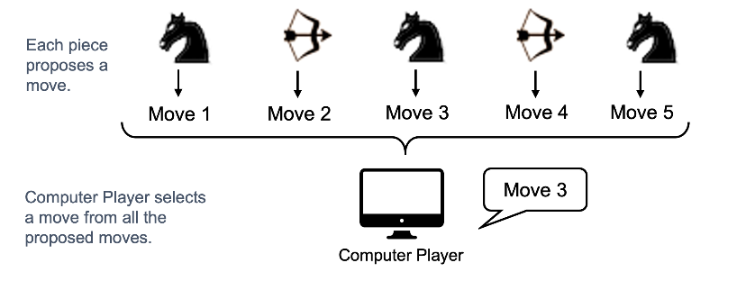

## COMP3021 2020Fall Programming Assignment 3

PA3 is to implement a **multi-threaded text** version of the game in PA1. There are a few changes in the rules.

**Reminder**

- Please ask questions using "Issues" on this github repository in case other students have same questions.
- Add TAs as cooperators to your private GitHub repository.

  -  arabela_tso@outlook.com
  -  troublor@live.com


## Changes from PA1

- For the computer player, each chess piece is run by **a separate thread**. 
- When it is computer player's round, **each chess piece** would propose an eligible move of itself based on an assigned **behavior**, which includes RANDOM, GREEDY (favors staying closest to the central), CAPTURING (favors capturing enemy pieces) and BLOCKING (favors restricting the number of possible moves by the enemy). Students may design **additional** behaviors ON TOP OF the three above. If so, they may put down the additional behaviors as Javadoc comments. 
- With different **behaviors**, each piece makes their **own** decision by proposing a next move. 
- A computer player has two **strategies**, which includes RANDOM and SMART (can be based on a smart heuristic or an objective function designed by students).
- With different strategies, one of all the proposed moves is selected by the computer player as the next move.



- When it is the human player's round, actions can be specified using the console.

- A critical region has been introduced. A critical region are M number of rows centered by the center place. Within which, no more than N pieces can enter the critical region. N, M are parameters that can be customized.


## Environment

The same as PA1 and PA2, using the following environments:

* Java `>= 14`
* Intellij IDEA (Community or Ultimate Edition) `>= 2020.2`


## Assignment Specification

### Piece

Each piece (both `Knight` and `Archer`) <u>on the computer player's side</u> should run in a separate **thread**, which can be paused, resumed and terminated. 

- **Pause**: when a piece thread is paused, it cannot make any moves until the thread is resumed.
- **Resume**: when a paused piece thread is resumed, it can move again.
- **Terminate**: when a piece thread is terminated, it cannot make any more moves until end of game.
- **getCandidateMove**: returns a candidate move. If no candidate move has been proposed within 1 second, then no candidate move can be proposed by this piece in this round.
- **Run**: a piece should be runnable, so the `run` method should be overwritten to handle the following situations:
- When it is NOT the turn of the computer player to which this piece belongs: the thread should be waiting
- When it is the turn of the computer player to which this piece belongs, and the piece has not been paused or terminated: the piece can propose a next move
- When the piece thread has been terminated: no moves can be proposed, and thus this piece cannot be moved.
- When the piece thread has been paused: no moves can be proposed until it has been resumed.

**Note**:

The pieces belonging to human player follow the same rules as in PA1.


### Player

There are two strategies of computer player: `RANDOM` and `SMART`. , both implementing interface `Player` as we did in
 PA1. 

**Note**: The `ConsolePlayer` extends `HumanPlayer`. There can be other kinds of Human Players in TA-only tests. So if you
 want to check the kind of player, use `instanceof HumanPlayer` to check whether a player is a human player. 

#### Computer Player

There are two strategies of computer player, one is `RANDOM`, the other is`SMART`. 

- Random: randomly select a move from all proposed moves by chess pieces
- Smart: select a move that is most likely to win from all proposed moves

For test smart behavior, the test will let Random Computer Player vs Smart Computer Player 5 times with the following 
configuration, if  Smart Computer Player wins 3 or more times, the test is passed.

- Board size: 15*15, protected steps 20, critical region size 5, critical capacity 2, random player plays first


#### Console Player (extends Human Player)

In PA1, console player receives only `Move` as input, while in PA3, more actions can be handled. 

Within`ConsolePlayer` class, the input string should be parsed and decide whether it is valid (either a move, or an action). 

- If the input is a valid move, then make the move.

- If the input is a valid action, then make the corresponding **actions** (see below) .


### Behavior

The `Behavior` specifies the behavioral preference of a piece (including `Knight` and `Archer`). 

#### RANDOM Behavior

The piece takes a random available move as the next move.

#### GREEDY Behavior

The piece prefers to move towards the central place.

#### BLOCKING Behavior

The piece prefers to blocking enemy's knight piece.

See how to block a knight here: https://en.wikipedia.org/wiki/Xiangqi (see `Horse`)

#### CAPTURING Behavior

The piece prefers to capture enemy's piece.


***NOTE***: 

`Behavior` is only useful for pieces belonging to a **computer** player. For pieces belonging to **human** players, it is the human player makes the decision.


### Strategy

The `strategy` includes RANDOM and SMART. It specifies which strategy a **computer player** adopts.

#### RANDOM Strategy

Among all the candidate next move proposed by pieces, a computer player with SMART strategy randomly pick one move from all the proposed moves.


#### SMART Strategy

Among all the candidate next move proposed by pieces, students need to design how SMART strategy works. It can be implemented based on a smart heuristic or an objective function. 

***NOTE***

Besides, since each piece has it's own behavioral preference, so when designing the SMART strategy, a configurable class `textversion/SmartPlayerFactory` is also provided so that students can customize `Behavior` for each piece.


### Action

##### Undo (UndoAction)

- Description: undo till the human player's last move

- Usage:

  ```shell
  [White] Make a Move/Action: undo
  ```

- Example:

  ```
  Round 1 (Human Player):
  - input:  move1
  - result: make move1
  
  Round 2 (Computer Player):
  - result: make move2
  
  Round 3 (Human Player):
  - input:  undo
  - result: roll back to Round 1 and wait for Human player's input
  - input: move3
  - result: make move3
  
  ```

- This action will call `undo` method in `Game` class and should consider the following situations:

  - Works normally
  - Handles `UndoException` when exception happens

##### Pause (PausePieceAction)

- Description: pause the piece thread at the given place. The piece should belong to computer player, and the place should have a piece. Once paused, the piece cannot propose moves until it has been resumed.

- Usage

  ```
  [White] Make a Move/Action: pause a1
  ```

- This action will call `pause` method in `Piece` class. The following situations should be considered:
  
  - Works normally
  - If piece does not exist at the specified place
  - If the piece does not belong to computer player

##### Resume (ResumePieceAction)

- Description: resume a paused piece thread at the given place. The piece should belong to computer player, and the place should have a piece. Once resumed, the piece can propose moves afterwards.

- Usage

  ```
  [White] Make a Move/Action: resume a1
  ```

- This action will call `resume`method in `Piece` class. The following situations should be considered:
  - Works normally
  - If piece does not exist at the given place
  - If the piece does not belong to computer player

##### Terminate (TerminatePieceAction)

- Description: Terminate a piece thread at the given place. The piece should belong to computer player, and the place should have a piece. Once stopped, the piece cannot propose moves (thus cannot move) any more, and cannot be resumed.

- Usage

  ```
  [White] Make a Move/Action: stop a1
  ```

- This action will call `stop`method in `Piece` class. The following situations should be considered:
  - Works normally
  - If piece does not exist at the given place
  - If the piece does not belong to computer player


### Configuration

#### addInitialPiece

In `Configuration` class, since each piece is run by a thread, the thread should start running when the piece is added to the chess board. 

Besides, a map from piece to the corresponding thread should be recorded.

#### Critical region

A critical region is added into configuration. It is prescribed by `criticalRegionSize` and `criticalRegionCapacity`.

- `criticalRegionSize`: the size of critical region. The requirement is specified in JavaDoc.
- `criticalRegionCapacity`: the maximum number of pieces inside the critical region.


**Example**:

 In a 5 * 5 board, which center place lies in the center of the 3rd row. Suppose `criticalRegionSize = 3` and `criticalRegionCapacity = 2`, then for the critical region row 2-4 (in total row 1-5), there are at most 2 pieces (regardless to which player that they belong) in it (row 2-4).


Remaining functions are the same as in PA1.


### CriticalRegionRule

This rule checks whether the number of pieces within the critical region is smaller or equal to the capacity of critical region.


### JesonMor

#### getAvailableMoves

When getting available moves, the role of current player should be distinguished:

- If current player is **human** player: the returned available moves should be an array of ALL available moves (works as in PA1)
- If current player is **computer** player: return an array containing only ONE move selected from all available moves.

#### undo

Undo the last human player's move.

- Example:

  ```
  Round 1 (Human Player):
  - input:  move 1
  - result: make move 1
  
  Round 2 (Computer Player):
  - result: make move 2
  
  Round 3 (Human Player):
  - input:  undo
  - result: roll back to Round 1 and wait for Human player's input
  - input: move 3
  - result: make move 3
  ```

At most **3 times** of undos can be executed.

If there are not enough steps that can be executed, an `UndoException` should be thrown.


## Student Tasks

Complete all the **TODOs** in the entire project. 

A detailed description of each task is provided in the **Javadoc** **above each method**. 

In IntelliJ IDEA, go to `View > Tool Windows > TODO` to jump to each TODO in the project. You may replace the placeholder implementation in the methods marked as TODO.

*Note:*

- **No bonus is provided in PA3.**


## Obfuscated Version

We provide an obfuscated demo of PA3, which can be found at `artifacts/PA3_obfuscated.jar`.

```
java -jar artifacts/PA3_obfuscated.jar <size> <numMovesProtection> <criticalRegionSize> <criticalRegionCapacity>
```


For example, 

```
java -jar artifacts/PA3_obfuscated.jar 9 1 1 1
```

where `9` represents board size, the first `1` stands for the number of protection steps, the second `1` stands for the size of critical region, the last `1` stands for the capacity of critical region. 

You can use `Ctrl-C/Command-C` to interrupt/terminate the program.

**Default**:

If no parameters are given, the default values for these parameters will be `5 1 1 1`.


## Code Skeleton

We provide code skeleton with detailed JavaDoc for you to complete this assignemnt. `// TODO` indicates that you should write your own code there. There are in total 24  `TODO`s (1 optional + 23 compulsory) for you to implement. 

**Note**:

**Do not modify** other parts of the Java code **unless hints in JavaDoc tell you to do that**, otherwise many tests will fail unexpectedly.


### Dependencies

Code of this assignment depends on several libraries, including `JUnit5` and Jetbrains `Annotations`. Jar package of these dependencies are provided in folder `lib`, you need to add `lib` folder as the library of your IntelliJ Project. Typically, this is already done, if you download use the prepared code in this repository.


### Program Entry

The main method is at `castle.comp3021.assignment.textversion.Main` class.


## Code Style

Maintaining [a good code](https://google.github.io/styleguide/javaguide.html) style in Java program is good practice for a developer. 
To help you practise good code style in Java programs, we provide a jar application to check the code style of your
 code. 

Usage: 

```
java -jar artifacts/checkstyle-8.36-all.jar -c artifacts/style_checks.xml com.puppycrawl.tools.checkstyle.gui.GUIMain src
```

If your code contains any bad code style, errors will show up with detailed information. 

Note that good code style is also a part of your grade in this assignment. 


## Submission Requirements

### Submission

Your submission is a zip file including: 

* The Java project. Please maintain the original file structure. 
* A `github_url.txt` file containing the url of your **private** repository. We will ask you to add TAs' accounts as collaborators.


You need to submit your zip file in [CASS](https://cssystem.cse.ust.hk/UGuides/cass/index.html) (not CANVAS).
Please also push on your github repository before the deadline!

The deadline of assignment 3 is **`10 Dec. 2020, 23:55`**. 


## Plagiarism

Do remember not to violate the following rules, otherwise it would be considered as an act of plagiarism.

* You must not share your code with your classmates.
* You must not copy code from your classmates.
* You must keep your Github Repository **Private** all the time. 

We will conduct code plagiarism tests on your submission, and handle it according to the [Honor
 Code](https://course.cse.ust.hk/comp3021/#HonorCode) if any extent of code plagiarism is found. 


## Grading Scheme

|                                        | Percentage | Remark                                                       |
| -------------------------------------- | ---------- | ------------------------------------------------------------ |
| Keep your Github repository private    | 0%         | You must keep your repository private all the time; otherwise deduct 5%. |
| At least 3 commits in different days   | 5%         | You must commit in **three** **different** days in your repository. |
| Pass all regression tests   |  5%        | (`# of passed tests` / `# of regression tests`) * 5% |
| Pass all TA-only tests                 | 80%        | (`# of passed tests` / `# of TA-only tests`) * 80%       |
| Code Style                             | 10%        | Get 10% if no error in code style checking. Deduct 1% for each 5 errors. |

*No bonus tasks are provided in PA3.*

